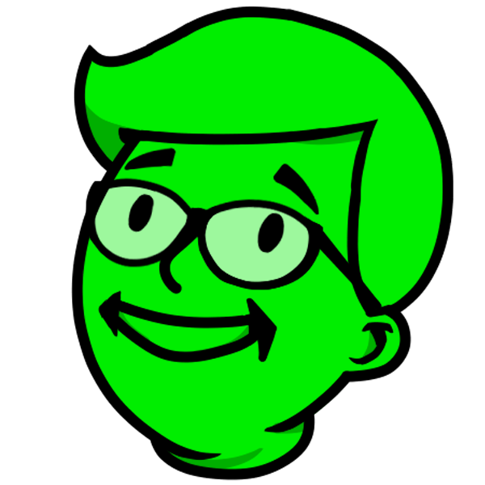
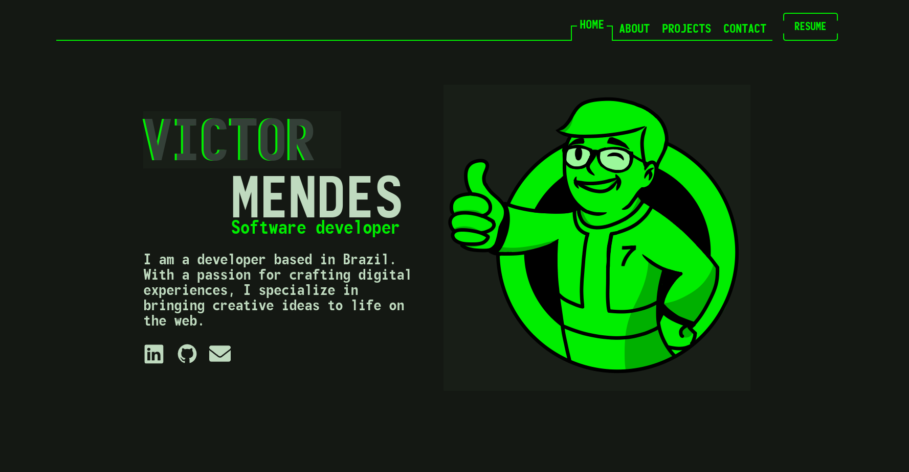

#  Me - Victor Mendes 

## 💡 Project Context

This is my personal portfolio, inspired by the Fallout [Pip-Boy](https://fallout.fandom.com/wiki/Pip-Boy) theme.

I also used these 2 amazing portfolios as inspiration, [Brittany Chiang's](https://github.com/bchiang7) portfolio [here](https://v4.brittanychiang.com/) and [Lars Olsom's](https://www.linkedin.com/in/larsui/) portfolio [here](https://www.lars-olson.com/).



## 🧰 Main technologies

<a href="https://styled-components.com/">
  
</a>

<a href="https://www.typescriptlang.org/">
  
</a>

<a href="https://reactjs.org/">
  
</a>

## 🛠 Running the application

1. Cloning and entering the repository

   ```sh
   git clone git@github.com:ImVictorM/Me.git && cd Me
   ```

2. Install dependencies

   ```sh
   npm install
   ```

3. Start the application
  - To start in development mode:

    ```sh
    npm run dev
    ```

  - To start in production mode:

    ```sh
    npm run build && npm run preview
    ```
